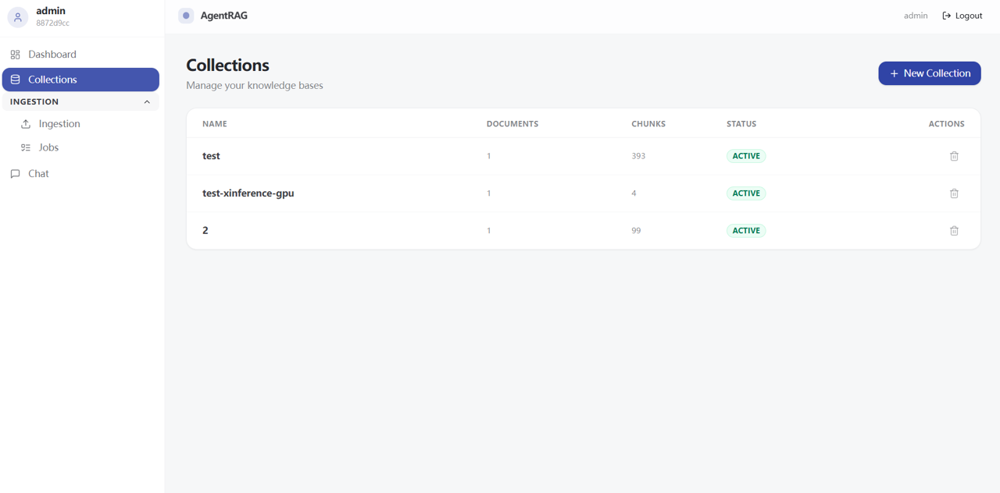
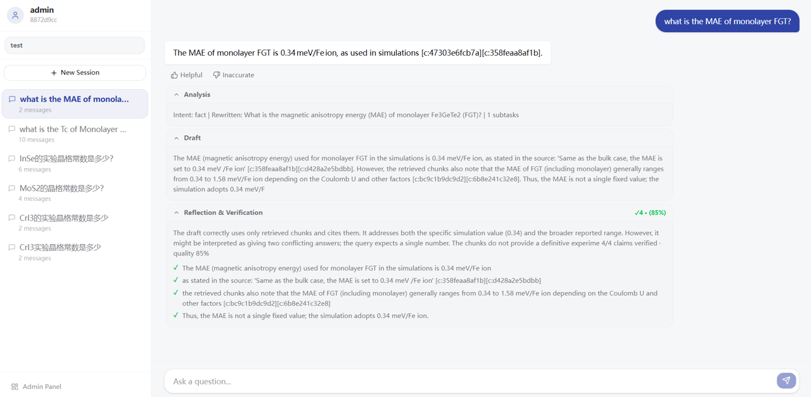

# AgentRAG

> Multi-Agent RAG system with GPU-accelerated embedding, knowledge graph, and full-text search.

## What is this?

AgentRAG is an intelligent question-answering system. Upload documents, then ask questions in natural language. The system retrieves relevant information from your documents and generates accurate answers using a multi-agent architecture backed by an LLM.

**Key features:**
- **Multi-agent reasoning** — router, understander, executor, verifier, reflector (LangGraph)
- **GPU-accelerated embedding** — Xinference + bge-m3 model on NVIDIA GPU
- **Hybrid search** — vector (Milvus) + full-text (Elasticsearch + IK) + knowledge graph (Neo4j)
- **Streaming responses** — SSE-powered real-time chat UI
- **Document ingestion pipeline** — background processing with retry and repair
- **Admin dashboard** — manage collections, documents, ingestion jobs

## Tech Stack

| Layer | Technology |
|-------|-----------|
| Frontend | React 18 + TypeScript + Vite 6 + Tailwind CSS 4 + Nginx |
| Backend | FastAPI + Python 3.12 + LangGraph |
| LLM | OpenAI-compatible API (DeepSeek, etc.) |
| Embedding | Xinference (bge-m3 on GPU) |
| Vector DB | Milvus (HNSW index) |
| Relational DB | PostgreSQL + pgvector |
| Full-text Search | Elasticsearch 8 (IK analyzer deferred, uses standard tokenizer) |
| Knowledge Graph | Neo4j 5 |
| Job Queue | Redis + ARQ |

## Prerequisites

| Requirement | Details |
|-------------|---------|
| **OS** | Windows 11 / WSL2 / Linux |
| **Docker** | Docker Desktop (Windows) or Docker Engine + Compose Plugin |
| **GPU** | NVIDIA GPU (GTX 1660 SUPER or better) for embedding acceleration |
| **RAM** | 16 GB minimum (32 GB recommended) |
| **Disk** | 20 GB free (models + data) |
| **CUDA** | Driver 451.48+ (Windows: install via [NVIDIA Driver](https://www.nvidia.com/Download/index.aspx)) |

> **No GPU?** The system still works — embedding will run on CPU (slower but functional).

## Quick Start

### 1. Clone the repository

```bash
git clone https://github.com/YOUR_USERNAME/AgentRAGProject.git
cd AgentRAGProject
```

### 2. Configure environment

```bash
# Copy the template
cp .env.example .env

# Edit .env — at minimum, set your LLM API key:
#   OPENAI_API_KEY=sk-your-key-here
#   OPENAI_BASE_URL=https://your-api-endpoint/v1
#   LLM_MODEL=your-model-name
```

### 3. Run the setup script

**Windows:**
```bash
setup.bat
```

**Linux / WSL:**
```bash
chmod +x setup.sh
./setup.sh
```

This script:
- Validates Docker and NVIDIA runtime
- Starts all 11 services via `docker compose up --build -d`
- Waits for core services to be ready
- Shows connection URLs

### 4. Open the app

| Service | URL |
|---------|-----|
| **Frontend** | http://localhost:3000 |
| **API Docs** | http://localhost:8000/docs |

Default login: `admin` / `admin` (change after first login)

## Architecture





```
Browser (:3000)
  └── Nginx (frontend)
       ├── Static SPA files
       └── /api/* → proxy → FastAPI (:8000)
            ├── PostgreSQL — users, collections, sessions, messages
            ├── Redis — background job queue (ARQ)
            ├── Milvus — vector embeddings
            ├── Neo4j — knowledge graph
            ├── Elasticsearch — full-text search
            ├── Xinference (:9997) — GPU embedding model (bge-m3)
            └── ARQ Worker — document ingestion pipeline
```

All infrastructure runs in Docker containers. The FastAPI backend and ARQ worker are built from the project source.

## Docker Services

| Service | Image | Port | Purpose |
|---------|-------|------|---------|
| postgres | pgvector/pgvector:pg16 | 5432 | Relational DB + vectors |
| milvus | milvusdb/milvus:v2.4.0 | 19530 | Vector search |
| redis | redis:7-alpine | 6379 | Job queue |
| neo4j | neo4j:5 | 7474, 7687 | Knowledge graph |
| elasticsearch | custom (IK plugin) | 9200 | Full-text search |
| xinference | xprobe/xinference:latest | 9997 | GPU embedding |
| fastapi | built from source | 8000 | Backend API |
| arq-worker | built from source | — | Background worker |
| frontend | built from source | 3000 | React SPA + Nginx |

## Common Operations

### View logs
```bash
docker compose logs -f
# Or for a specific service:
docker compose logs -f fastapi
```

### Stop services
```bash
docker compose down
```

### Stop and clean all data
```bash
docker compose down -v
```

### Run database migrations
```bash
docker compose exec fastapi alembic upgrade head
```

### Reset admin password
```bash
# When running locally (not in Docker):
python scripts/reset_admin_pwd.py

# Or inside the container:
docker compose exec fastapi python scripts/reset_admin_pwd.py
```

### Check system health
```bash
curl http://localhost:8000/api/v1/admin/health
```

### Run tests
```bash
# Requires Python environment set up locally:
pip install -e ".[dev]"
pytest tests/ -v
```

### GPU verification
```bash
python tests/gpu_verify.py
```

## Configuration

All configuration is via the `.env` file. Key variables:

| Variable | Default | Description |
|----------|---------|-------------|
| `OPENAI_API_KEY` | *(required)* | Your LLM provider API key |
| `OPENAI_BASE_URL` | `https://api.deepseek.com/v1` | LLM API endpoint |
| `LLM_MODEL` | `deepseek-v4-flash` | Model name to use |
| `XINFERENCE_ENDPOINT` | `http://xinference:9997` | GPU embedding server (Docker: use service name; local: `http://127.0.0.1:9997`) |
| `RERANKER_PROVIDER` | `rrf` | Reranker: `rrf` (free, zero-cost) / `bge` (requires FlagEmbedding) / `cohere` |
| `SECRET_KEY` | `change-me-in-production` | JWT signing key — **change this!** |
| `NEO4J_PASSWORD` | `agentrag123` | Neo4j database password |

## Troubleshooting

### Frontend shows connection error
Make sure the backend is running: `docker compose ps` — check that `fastapi` and `arq-worker` are `Up`.

### GPU embedding not working
1. Check NVIDIA Docker support: `docker info \| grep -i nvidia`
2. Verify GPU is visible: `nvidia-smi`
3. Check xinference logs: `docker compose logs xinference`

### Document upload fails / hangs
- Check Docker memory: `docker stats` — ensure containers aren't OOM-killed
- The `fastapi` container has a 3 GB memory limit. Increase in `docker-compose.yml` if needed.

### Can't log in
- Default credentials: `admin` / `admin`
- If password was changed and forgotten: run `python scripts/reset_admin_pwd.py`

### Services won't start on first run
- First run downloads models (bge-m3 ~2.4 GB, Elasticsearch plugins). Be patient.
- Check progress: `docker compose logs -f`

## Project Structure

```
AgentRAGProject/
├── app/                      # Python backend
│   ├── adapters/             # Pluggable AI components
│   │   ├── embedding/        # Xinference, BGE-M3
│   │   ├── llm/              # OpenAI, Ollama
│   │   ├── reranker/         # BGE, Cohere, RRF
│   │   ├── search/           # Elasticsearch
│   │   ├── vector_store/     # Milvus
│   │   └── chunker/          # Document chunking
│   ├── agents/               # LangGraph multi-agent system
│   ├── api/v1/               # REST API endpoints
│   ├── core/                 # Config, DI, middleware
│   ├── domain/               # SQLAlchemy models
│   ├── ingestion/            # Document pipeline
│   ├── memory/               # Session management
│   ├── services/             # Business logic
│   ├── workers/              # ARQ background jobs
│   └── main.py               # FastAPI entry point
├── frontend/                 # React SPA
│   ├── src/                  # Application source
│   ├── Dockerfile            # Multi-stage build
│   └── nginx.conf            # Nginx proxy config
├── scripts/                  # Utility scripts
├── tests/                    # Test suite
├── alembic/                  # Database migrations
├── docker-compose.yml        # Service orchestration
├── Dockerfile                # Backend image
├── Dockerfile.es             # Elasticsearch + IK plugin
├── pyproject.toml            # Python dependencies
├── setup.bat / setup.sh      # Launcher scripts
└── .env.example              # Configuration template
```

## License

MIT
